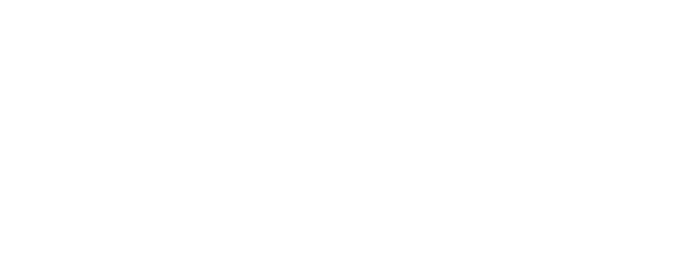
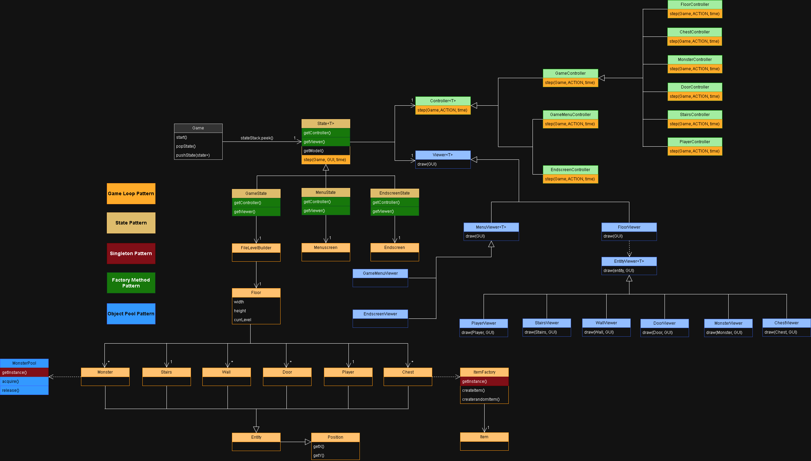
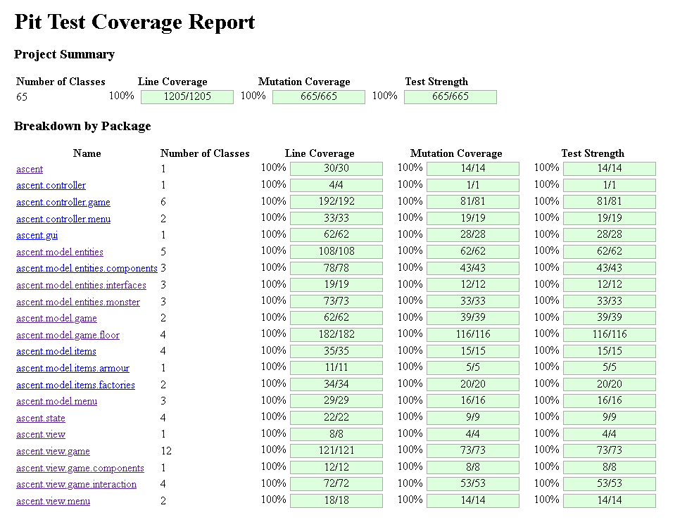

<div align="center">
  <picture>
    <source media="(prefers-color-scheme: dark)" srcset="resources/ascci-title-white.png">
    <source media="(prefers-color-scheme: light)" srcset="resources/ascci-title-black.png">
    
  </picture>

  <br/>

In this roguelike dungeon-crawler, you, the player, must go through several dangerous levels of the deep-dark caves above Narnia, in which you will fight through hordes of enemies to ascend to the next level. As you ascend, the danger will continuously escalate, but so will your ability to deal with them.

  <br/>


  <br/>

Developed by a team of 3 for **LDTS 2025/26** (Software Design and Testing Laboratory), a curricular unit of the 2nd year of the Computer Engineering degree at FEUP.

</div>

---

## Table of Contents

- [How to Run](#how-to-run)
- [Controls](#controls)
- [Implemented Features](#implemented-features)
- [Architecture & Design Patterns](#architecture--design-patterns)
- [UML](#uml)
- [Test Coverage](#test-coverage)
- [Credits](#credits)

---

## How to Run

**Prerequisites:** Java 17+

```bash
./gradlew run        # macOS / Linux
gradlew.bat run      # Windows
```

> A terminal width of at least ~100 columns is recommended for the HUD to render correctly.

---

## Controls

### Movement

| Input                  | Action                           |
| ---------------------- | -------------------------------- |
| `W` `A` `S` `D`        | Move                             |
| Arrow keys             | Move (alternative)               |
| `Shift` + movement key | Look in direction without moving |
| `E`                    | Interact (door, chest, stairs)   |

### Inventory

| Input     | Action                        |
| --------- | ----------------------------- |
| `1` – `5` | Use health potion in slot 1–5 |
| `Alt + 1` | Unequip weapon                |
| `Alt + 2` | Unequip head armour           |
| `Alt + 3` | Unequip chest armour          |
| `Alt + 4` | Unequip arm armour            |
| `Alt + 5` | Unequip leg armour            |
| `Alt + 6` | Unequip feet armour           |

### System

| Input    | Action       |
| -------- | ------------ |
| `Escape` | In-game menu |

---

## Implemented Features

- **Ascent.Game loop** - The game continuously reads and interprets the input of the player
- **Character movement** - The player can control their character using the arrow keys or wasd keys. They can also only change their looking direction by holding SHIFT while pressing the movement keys.
- **Collision detection** - The player character cannot phase through other entities.
- **Multiple levels** - The game progresses through 5 hand-made levels that are stored in the 'levels' folder.
- **Stats** - The player and the monsters have different stats, used to calculate fights, movement and awareness.
- **Monster Pathfinding** - Each monster has an awareness stat that determines how far they can detect the player and move towards them.
- **Menus** - The game has separate menus for: Main menu, Game menu, Death screen & Win screen.
- **Interactions** - The player can open & close doors & chests, pick up or equip items from chests & go up levels through stairs.
- **Items** - Each level has chests that contain items, from equipment to health potions, that affect the players stats and are essential for progression.
- **Game HUD** - The game displays an in-game HUD that displays player stats, the player inventory, stats of the last monster the player interacted with (if any) and an interaction dialog if the player is looking at any interactable entity.

---

## Architecture & Design Patterns

The project follows a strict **MVC** structure throughout. The sections below describe the design decisions made during development and their trade-offs.

---

### **MOVING THE GAME FORWARD**

For a non-turn-based game, entities must move as time progresses.

**The Pattern**
We applied the **Game Loop** pattern. On every in-game tick, each `Entity` moves a step forward.

**Implementation**
The game loop is started in the `Game` class:
_(src/main/java/Ascent/Game)_

---

### **SINGLE ITEM FACTORY**

Creating multiple item factories could lead to inconsistent item generation and wasted resources. We needed a single factory to enforce consistent creation rules across the code.

**The Pattern**
We applied the **Singleton** pattern. This ensures the `ItemFactory` class has only one instance with a global point of access via `getInstance()`.

**Implementation**
_(src/main/java/Ascent.model/item/factories/ItemFactory.java)_

**Consequences**
Guarantees consistent item creation and saves resources through lazy initialization. It makes testing harder due to global state and is not thread-safe, which is acceptable since our game runs on a single thread.

---

### **MONSTER SPAWNING PERFORMANCE**

Constantly creating and destroying `Monster` objects across multiple levels causes garbage collection pauses and performance drops. We also needed a single shared pool to prevent monsters from being mixed up and breaking the system.

**The Pattern**
We applied the **Object Pool** pattern combined with the **Singleton** pattern. The pool maintains pre-created monsters. We use `acquire()` to get a monster and `release()` to return it. The Singleton ensures only one pool exists.

**Implementation**
_(src/main/java/Ascent/model/entities/poolsMonsterPool.java)_
_(src/main/java/Ascent/model/entities/poolsMonster.java)_
_(src/main/java/Ascent/model/game/level/BaseplateBuilder.java)_

**Consequences**
Improves performance and reduces garbage collection pauses. It increases code complexity because we must manage pool states and reset methods. Additionally, the pool has a hard limit on concurrent monsters.

---

### **IMPLEMENTING DIFFERENT GAME STATES**

The game logic must change depending on whether the player is in a menu or in-game.

**The Pattern**
We applied the **State** pattern, implemented as a _Stack of States_. Transitions push new states onto the stack, and ending a state pops the topmost state off.

**Implementation**
_(src/main/java/Ascent/state)_

**Consequences**
This stack implementation prevents menus from overlaying and viewing the active game map, as the game state is pushed down the stack and out of the top spot.

---

### **DIVIDING STEPS TO CREATE FLOOR**

Initializing complex `Floor` components (walls, monsters, chests, doors) directly inside the class creates overly complicated and rigid code. We needed a flexible, step-by-step solution.

**The Pattern**
We applied the **Builder** pattern. The `FloorBuilder` abstract class defines the construction steps. `FileLevelBuilder` is a concrete implementation that fulfills these steps by parsing a text file.

**Implementation**
_(src/main/java/ascent/model/game/floor/FloorBuilder.java)_
_(src/main/java/ascent/model/game/floor/FileLevelBuilder.java)_

**Consequences**

- **Separation of Concerns:** Isolates file parsing logic in `FileLevelBuilder`.
- **Extensibility:** Easy to add new level creation strategies.
- **Modularity:** Breaks construction into readable, discrete steps.

---

### **DECOUPLING PATHFINDING IMPLEMENTATION FROM USAGE**

Monsters need to navigate, but hardcoding the algorithm prevents easy swapping for future improvements or testing.

**The Pattern**
We applied the **Strategy** pattern. We created an `IPathFinder` interface. Monsters rely on this interface rather than the concrete `PathFinder` implementation.

**Implementation**
_(src/main/java/ascent/model/game/IPathFinder.java)_
_(src/main/java/ascent/model/game/PathFinder.java)_

**Consequences**
Enables seamless swapping of pathfinding algorithms without altering monster logic.

---

### **HANDLING USER ACTIONS**

Processing keyboard inputs directly in the game loop creates messy conditional statements. Action requests must be decoupled from their execution.

**The Pattern**
We applied a variation of the **Command** pattern. The `ACTION` enum represents user commands. The `Controller` interprets and executes these logic steps.

**Implementation**
_(src/main/java/ascent/gui/ACTION.java)_
_(src/main/java/ascent/controller/Controller.java)_

**Consequences**

- **Flexibility:** Allows mapping multiple inputs to a single action.
- **Readability:** Replaces key-code checks with clean switch statements.
- **Extensibility:** New commands can be added systematically.

---

### **COMPOSITION OVER INHERITANCE**

Deep inheritance trees create rigid code when entities share non-hierarchical behaviors, like `Stats` for both players and monsters.

**The Pattern**
We applied the **Component** pattern. The `Entity` class and its subclasses hold component instances (`Stats`, `Inventory`, `LOOKING`) instead of inheriting all behavior.

**Implementation**
_(src/main/java/ascent/model/entities/components/Stats.java)_
_(src/main/java/ascent/model/entities/components/Inventory.java)_

**Consequences**
Keeps `Entity` classes lighter, more focused, and highly modular.

---

### **ELIMINATING SWITCH STATEMENTS WITH SMART ENUMS**

Handling directions and entity types typically causes large, brittle switch statements in the Controller. Data and behavior should be bundled together.

**The Pattern**
We applied the **State Pattern** (via **Smart Enums**). Enums act as state-carriers containing their own data and logic.

- **`LOOKING` Enum:** Stores coordinate deltas and calculates the next position via `move(Position)`.
- **`MonsterType` Enum:** Defines configuration data and factory methods for specific monster types.

**Implementation**
_(src/main/java/ascent/model/entities/components/LOOKING.java)_
_(src/main/java/ascent/model/entities/monster/MonsterType.java)_

**Consequences**

- **Cleaner Code:** Removes bulky direction-checking switch statements.
- **Extensibility:** Adding new types or directions requires minimal logic changes.
- **Safety:** The Enum constructor guarantees valid configurations at compile-time.

---

## UML

Class diagram highlighting the main design patterns applied across the codebase.



> The original full-resolution image is at `docs/Ascent.png`.

---

## Test Coverage

Unit tests written with JUnit 5 and Mockito. Mutation testing performed via PiTest to verify test effectiveness beyond line coverage.



---

## Credits

Developed by a team of three for LDTS 2025/26 at FEUP.

| Name          | GitHub                                           |
| ------------- | ------------------------------------------------ |
| Daniel        | [@dcl09](https://github.com/dcl09)               |
| Nuno          | [@NunoMCoimbra](https://github.com/NunoMCoimbra) |
| [Contributor] |                                                  |

## License

This project is licensed under the [MIT License](LICENSE).
